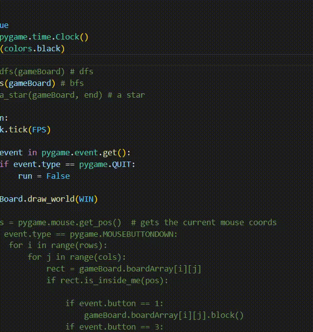
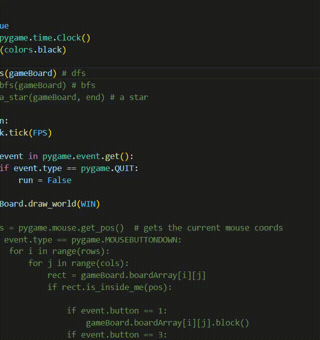
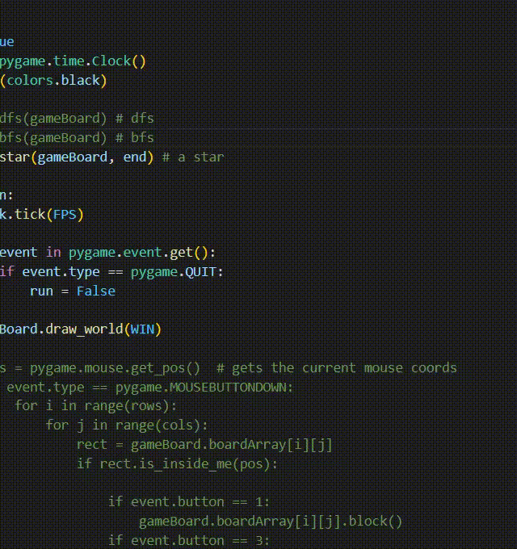

# Maze Solver & Visualizer

This project is a maze-solving application built with **Pygame** that visually demonstrates popular pathfinding algorithms. It can solve any given maze using **Depth-First Search (DFS)**, **Breadth-First Search (BFS)**, and the **A-Star (A\*)** algorithm.

The application visualizes the entire process, showing which cells are being explored and highlighting the final, shortest path from the start to the goal. It also includes a feature to create, edit, and save custom maze layouts.

## 🚀 Features

  * **Algorithm Visualization**: Watch in real-time as the algorithms explore the maze.
  * **Multiple Solvers**: Implements three different pathfinding algorithms:
      * Depth-First Search (DFS)
      * Breadth-First Search (BFS)
      * A-Star (A\*) Search
  * **Maze Customization**: Easily create your own mazes by blocking or unblocking cells with your mouse.
  * **Save & Load Mazes**: Save your custom-designed mazes as `.npy` files to use them later.
  * **Clear Path Highlighting**: The final path found by the algorithm is clearly distinguished from the explored cells.

## 🤖 Demos

Here are the three implemented algorithms solving the same maze.

### Breadth-First Search (BFS)


### Depth-First Search (DFS)


### A-Star (A\*)


-----

## 🛠️ Technologies Used

  * **Python**
  * **Pygame**: For visualization and user interface.
  * **NumPy**: For saving and loading maze arrays.

-----

## ⚙️ Setup and Usage

Follow these steps to get the project running on your local machine.

### Prerequisites

Make sure you have Python 3 installed.

### Installation

1.  **Clone the repository:**

    ```sh
    git clone https://github.com/Mohammad-Momeni/Maze-Solver/
    cd Maze-Solver
    ```

2.  **Install the required libraries:**

    ```sh
    pip install pygame numpy
    ```

### How to Run

1.  **Select an algorithm:**
    Open the `main.py` file and uncomment the line for the algorithm you want to visualize.

    ```python
    # agent.dfs(gameBoard) # Uncomment for DFS
    # agent.bfs(gameBoard) # Uncomment for BFS
    agent.a_star(gameBoard, end) # Uncomment for A*
    ```

2.  **Run the application:**

    ```sh
    python main.py
    ```

### Creating and Saving a New Maze

1.  **Enable Maze Editor:**
    In `main.py`, comment out the algorithm calls and uncomment the code block inside the `while run:` loop. This enables mouse controls for editing.

    ```python
    # In main() function
    while run:
        clock.tick(FPS)

        for event in pygame.event.get():
            if event.type == pygame.QUIT:
                run = False
        
        # --- UNCOMMENT THIS BLOCK TO EDIT THE MAZE ---
        # pos = pygame.mouse.get_pos()
        # if event.type == pygame.MOUSEBUTTONDOWN:
        #     for i in range(rows):
        #         for j in range(cols):
        #             rect = gameBoard.boardArray[i][j]
        #             if rect.is_inside_me(pos):
        #                 if event.button == 1: # Left-click to add a wall
        #                     gameBoard.boardArray[i][j].block()
        #                 if event.button == 3: # Right-click to remove a wall
        #                     gameBoard.boardArray[i][j].unblock()

        # saveNewBoard(<maze-name>)

        gameBoard.draw_world(WIN)
    ```

2.  **Save the Maze:**
    After editing the maze, the `saveNewBoard()` function call at the end of `main.py` will save your layout.

    ```python
    # ... after the while loop
    # saveNewBoard('MyCustomMaze') # Give your maze a name
    pygame.quit()
    ```

-----

## 📂 File Structure

The project is organized into several files, each with a specific responsibility:

  * `main.py`: The main entry point of the application. It initializes Pygame, creates the game board, and runs the main loop.
  * `Agent.py`: Contains the implementation of the **DFS**, **BFS**, and **A\*** pathfinding algorithms.
  * `Environment.py`: Defines the `Board` class, which manages the grid, tiles, and drawing operations.
  * `tile.py`: Defines the `Tile` class, representing a single cell in the maze.
  * `params.py`: Stores global parameters like screen dimensions and grid size.
  * `colors.py`: A utility file that defines the RGB color constants used in the project.
  * `/Mazes`: A directory where the `.npy` files for the maze layouts are stored.
